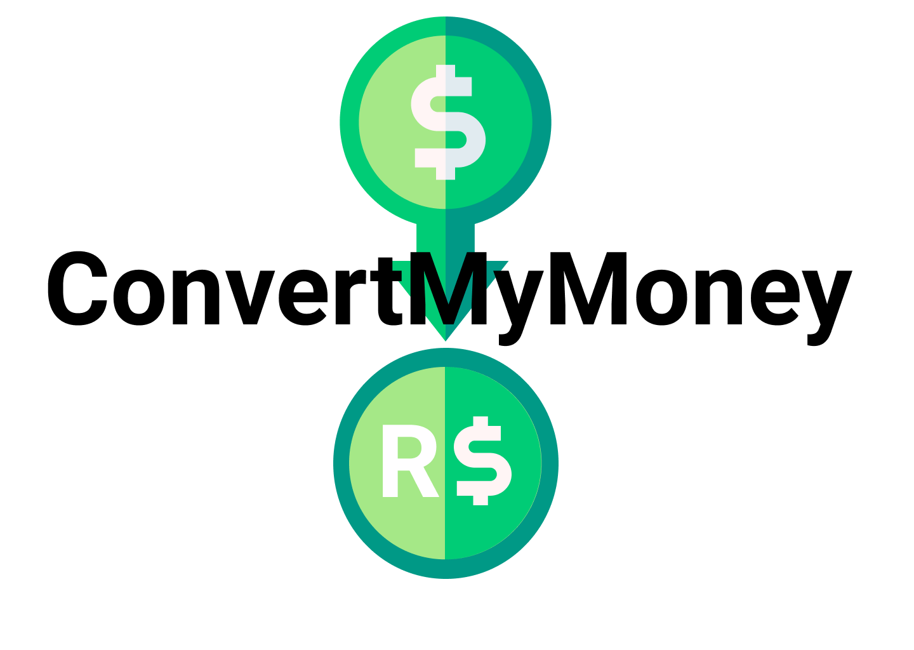

<p align="center">
  <a href="https://convertmymoney-tawny.vercel.app/">
    
  </a>
</p>

# Convert My Money

Este projeto foi desenvolvido no curso Fullstack Master da Dev Pleno, ministrado pelo [Túlio Faria](https://tuliofaria.dev/). Uma versão online está disponível em: https://convertmymoney.williamtome.vercel.app/


## Funcionalidades:
Permite você obter a conversão da quantidade de dinheiro em reais (moeda brasileira **R$**) para o valor total em dólares (**$**) de acordo com a cotação atual do dólar por meio da API pública do Banco Central do Brasil **BCB**.

__Obs__: O sistema não fornecerá a cotação do dólar nos **finais de semana**, nem nos **feriados**.

## Tecnologias:

* [NodeJS](https://nodejs.org/en/)
* [EJS](https://ejs.co/)
* [Jest](https://jestjs.io/)
* [CSS](https://developer.mozilla.org/pt-BR/docs/Web/CSS)

## Pré-requisitos:

1. Você precisa do NodeJS e do NPM instalado em sua máquina.
2. Faça o clone do repositório wm um diretório local de sua preferência.
3. Execute estes comandos abaixo:
```
npm install
node index.js
```
4. Acesse <code>localhost:3000</code> e pronto!

## Colocado em produção:

Este projeto foi hospedado na [Vercel]('https://vercel.com).

## Autores:

* **Tulio Faria** - [LinkedIn](https://www.linkedin.com/in/tuliofaria/)
* **William Weirich Tomé** - [Linkedin](https://www.linkedin.com/in/williamtome/)

## Licença

Este projeto é licenciado sobre a licença MIT - veja [LICENSE.md](LICENSE.md) para mais informações.

## Acknowledgments

* Este projeto foi construído durante o treinamento Fullstack Master do [DevPleno](https://devpleno.com).
